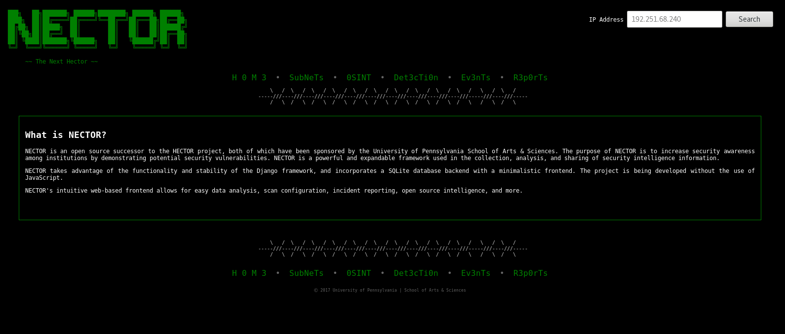

# NECTOR - by haX0rs for haX0rs



## About NECTOR

 NECTOR is an open source successor to the HECTOR project, both of which have been sponspored by the University of Pennsylvania School of Arts & Sciences. The purpose of NECTOR is to increase security awareness among institutions by demonstrating potential security vulnerabilities. NECTOR is a powerful and expandable framework used in the collection, analysis, and sharing of security intelligence information.

NECTOR takes advantage of the functionality and stability of the Django framework, and incorporates a SQLite database backend with a minimalistic frontend. The project is being developed without the use of JavaScript in order to promote anti-XSS and anti-clickjacking protection.

NECTOR's intuitive web-based frontend allows for easy data analysis, scan configuration, incident reporting, and more. 

## Misc. Notes

Lets try to stick with Python2 for now.

This is the main NECTOR project repo.

We'll be adding small applications to this project over time.

Applications:

- hosts (subnets)
- detection
- osint
- events
- reports

## Installing

View INSTALL.txt for more info.

## Getting Started

Create a virtualenv to work in and activate it.

'''
$ virtualenv-2 venv-nector
$ source venv-nector/bin/activate
$ pip install < requirements.txt
'''

Apply the migrations. TODO: explain this

```$ python manage.py migrate```


Start the server.

'''$ python manage.py runserver'''


Open a browser and goto 127.0.0.1:8000

When you're done working run ```$ deactivate```.

